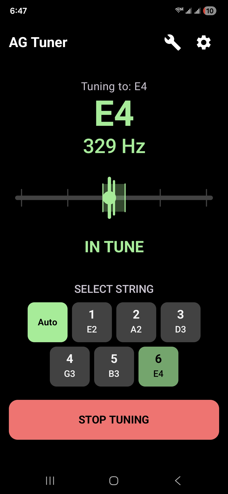
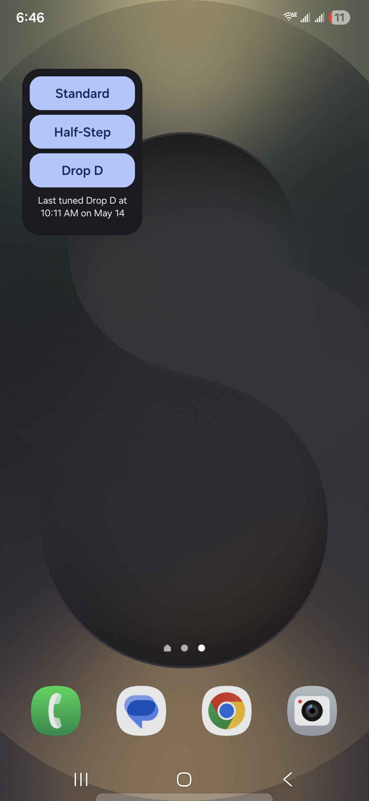
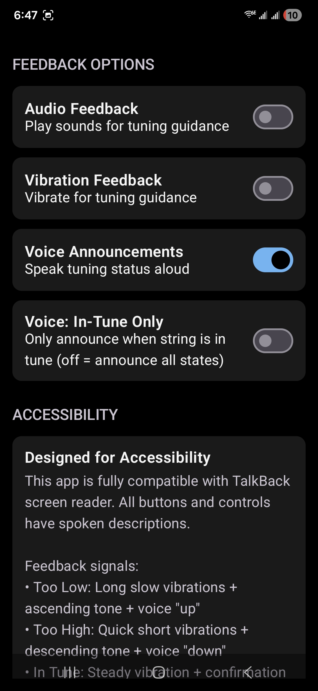
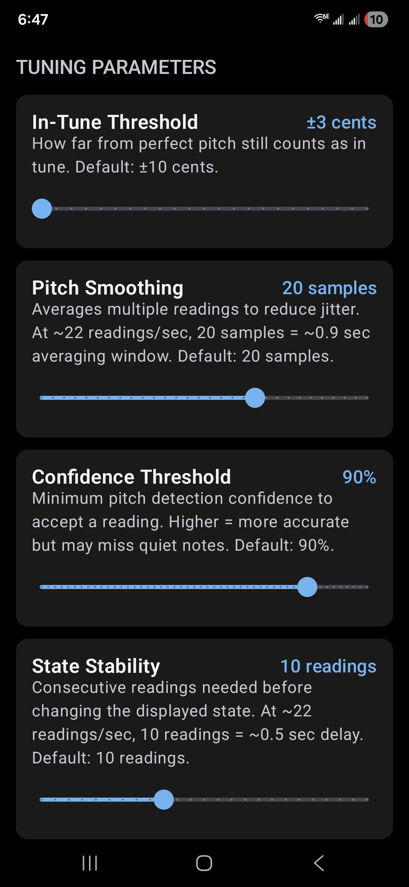

# AG Tuner

A simple, fast, accessible guitar tuner for Android. No ads, no accounts, no data collection. Use the widget to select a tuning and open the app — it's ready to tune, just play a string.

Built because Anthony Ferraro, a blind guitarist on YouTube, mentioned in a video that there wasn't an accessibility-focused guitar tuner for phones. Every tuner app I'd tried also felt bloated — welcome screens, account prompts, in-app purchases, several taps to start tuning.

<p align="center">
  
  &nbsp;
  
  &nbsp;
  
  &nbsp;
  
</p>

## Features

- Home-screen widget launches the app into Standard, Half-Step Down, or Drop D with one tap
- Auto-detect mode identifies which string you're playing
- Custom tunings: any number of strings, any notes
- Visual, audio, haptic, and voice feedback (independently toggleable)
- Adjustable in-tune threshold, pitch smoothing, confidence threshold, and state stability

## Accessibility

- Full TalkBack support with phonetically-spelled note names ("E flat 2", not "E♭2")
- Voice announcements of tuning state, with an in-tune-only option
- Distinct haptic patterns per state (long-slow for flat, quick-short for sharp, steady for in-tune)
- Descriptive content on every control
- Settings info card explaining each feedback signal

## Privacy

- No data collection
- No ads
- No accounts or sign-in
- No network access — audio never leaves the device
- No in-app purchases

The only permission requested is `RECORD_AUDIO`.

## Installing

### From the Play Store

Currently in closed testing while gathering the testers Google requires before public release. To be added to the tester list, email your Google account address to errol.app@gmail.com.

### Build from source

Requirements: Android Studio with the bundled JDK 17, and an Android device or emulator running API 26 (Android 8.0) or newer.

```bash
git clone https://github.com/JesseMH/AGTuner.git
cd AGTuner
./gradlew assembleDebug
adb install app/build/outputs/apk/debug/app-debug.apk
```

On Windows PowerShell, set `JAVA_HOME` first:

```powershell
$env:JAVA_HOME = "C:\Program Files\Android\Android Studio\jbr"
.\gradlew.bat assembleDebug
```

## How it works

- Audio capture via `AudioRecord` using the `UNPROCESSED` source (falls back to `MIC`), bypassing AGC and noise suppression
- Pitch detection via YIN on 50%-overlapped 2048-sample windows (~43 fps gauge updates)
- UI: Jetpack Compose + Material 3
- Widget: Jetpack Glance
- Persistence: DataStore
- DI: Hilt
- minSdk 26 / targetSdk 35

## Contributing

Issues and pull requests welcome. Keep changes focused, match the existing style, and verify with `./gradlew lint assembleDebug`. No automated test suite yet — verification is lint clean and a functional check.

## License

[MIT](LICENSE).
